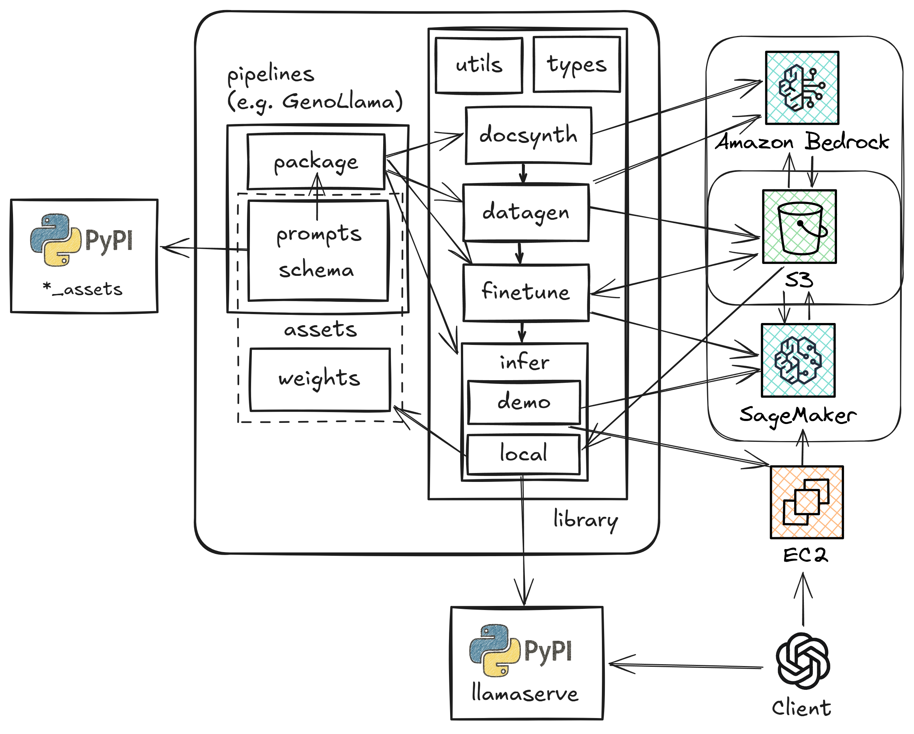

# SchemaLlama

Training Llama LLMs for biomarker extraction from unstructured NHS documents.

## Pipelines

Current pipelines in this repository:

- [OncoLlama](pipelines/oncollama/): Generating high fidelity synthetic cancer letters, and fine-tuning LLMs for structured data extraction.

- [GenoLlama](pipelines/genollama/): Training LLMs for genomic biomarker extraction from NHS genomic laboratory hub reports.

## Repository structure

```
📁 SCHEMA_LLAMA
├── pipelines/             # Individual pipelines for developing text to schema models
├── assets/                # Static per-pipeline assets
├── lib/                   # Reusable functionality across pipelines
├──── docsynth/            # Configuration driven unstructured document generation
├──── datagen/             # Bootstrapping synthetic data for LLM fine-tuning
├──── finetune/            # LLM fine-tuning
├──── infer/               # LLM inference
├────── demo/llamadeploy   # Deploy a Llama model on AWS SageMaker AI
├────── demo/deploy        # Deploy LiteLLM proxy for SageMaker AI Llama models
├────── local/deploy       # Deploy model weight distribution infrastructure for llamaserve
├────── local/llamaserve   # Serve llama models locally
├──── types/               # Cross-project type definitions
├──── utils/               # Reusable functions
└── README.md              # Project overview and documentation
```



## Worked examples

### Generating synthetic oncology documents for OncoLlama

1. We want to call [`generate`](lib/docsynth/src/docsynth/generate.py#L128) from the [`Generator`](lib/docsynth/src/docsynth/generate.py#L19) class to create our documents.

2. We know that [`generate`](lib/docsynth/src/docsynth/generate.py#L128) accepts a child class of [`SchemaLlamaAssets`](lib/types/src/schemallama_types/assets.py#L174) as an argument -- which wraps up the prompt templates and related files generate needs to create synthetic documents for a given domain -- and we know that it imports this from our [`types`](lib/types) package.

3. We create a new package in [`assets`](assets/) called [`oncollama`](assets/oncollama/), and populate it with the [recommended assets](lib/docsynth/README.md#assets). This includes a subclass of [`SchemaLlamaAssets`](lib/types/src/schemallama_types/assets.py#L174) (imported from our [`types`](lib/types) package) called [`OncoLlamaAssets`](assets/oncollama/src/oncollama_assets/__init__.py#L6).

4. We create our [oncollama pipeline](pipelines/oncollama/) if it doesn't exist, and then import both the [`OncoLlamaAssets`](assets/oncollama/src/oncollama_assets/__init__.py#L6) and [`Generator`](lib/docsynth/src/docsynth/generate.py#L19) classes:

    ```python
    from oncollama_assets import OncoLlamaAssets
    from docsynth.generate import Generator
    ```

5. We combine everything together, to generate our documents:

    ```python
    Generator().generate(OncoLlamaAssets())
    ```