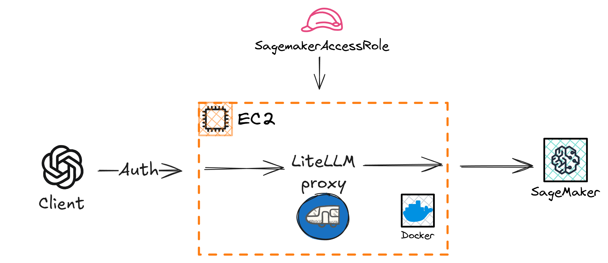

# Deploy LiteLLM proxy for SageMaker AI Llama models



## Prerequisites

### Dependencies

- [uv](https://docs.astral.sh/uv/getting-started/installation/)
- [terraform](https://developer.hashicorp.com/terraform/tutorials/aws-get-started/install-cli)
- [nodejs](https://nodejs.org/en/download) (optional for formatting)

### Other

1. Generate an SSH key to be used to interface with AWS (EC2):

    ```bash
    ssh-keygen -t ed25519 -f ~/.ssh/host-aws -C "YOUR_EMAIL@example.com"
    ```

2. Reference this SSH key in a 'catch all' host entry in the SSH config file: `~/.ssh/config`:

    ```
    Host *.compute.amazonaws.com *.compute-1.amazonaws.com *.compute.internal
        User ubuntu
        IdentityFile ~/.ssh/host-aws
        IdentitiesOnly yes
    ```

## Deployment

Following the [deployment of a Llama model](https://github.com/londonaicentre/GenoLlama/tree/main/infer#deploy-a-llama-model) on SageMaker AI, run:

1. `make init` to run setup tasks

2. `make up` to deploy the proxy

3. `make down` to remove the proxy 

