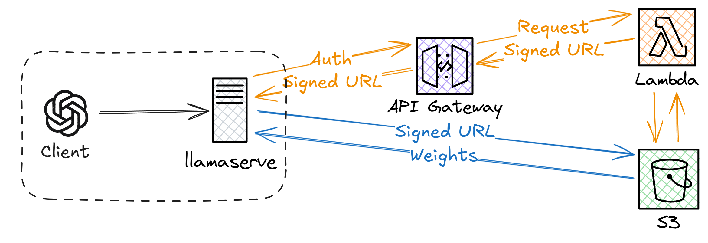

# Deploy model weight distribution infrastructure for llamaserve

## Prerequisites

### Dependencies

- [uv](https://docs.astral.sh/uv/getting-started/installation/)
- [terraform](https://developer.hashicorp.com/terraform/tutorials/aws-get-started/install-cli)

## Development

1. Run `uv sync` to add development dependencies:

2. Develop Lambda function:

    1. `make prettier` for formatting

    2. `mypy` for type checking

## Deployment

1. Add required variables to (a new file) `terraform.tfvars`, guided by the variables listed in [`variables.tf`](variables.tf).

2. Connect to AWS, e.g. by setting up [`granted`](https://docs.commonfate.io/granted/getting-started) and activating a profile.

3. Initialise terraform: `terraform init`.

4. Check terraform actions: `terraform plan`.

5. Set up infrastructure: `terraform apply`.

