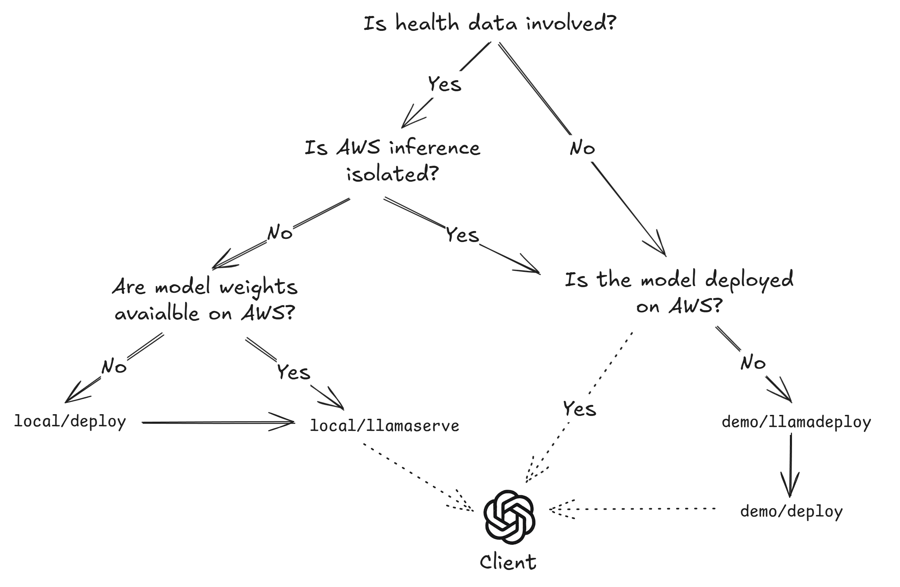

# Run inference using a Llama model on AWS Sagemaker or locally

## Folder structure



```
📁 INFER
├── lib/                   # Reusable functionality across pipelines
├──── infer/               # LLM inference
├────── demo/llamadeploy   # Deploy a Llama model on AWS SageMaker AI
├────── demo/deploy        # Deploy LiteLLM proxy for SageMaker AI Llama models
├────── local/deploy       # Deploy model weight distribution infrastructure for llamaserve
├────── local/llamaserve   # Serve llama models locally
```